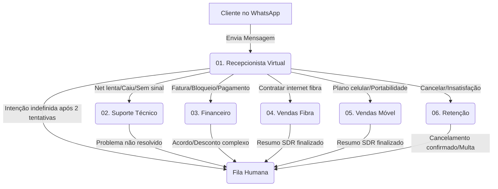

# Tutorial: Como Criar a Árvore de Agentes no Evo CRM

Este guia ensina como configurar os agentes de IA para integração HubSoft × Evo CRM, criando um sistema de roteamento inteligente (Orquestrador → Especialistas) usando o wizard nativo do Evo CRM.

> **Modelo recomendado:** GPT-4.1-mini (function calling nativo, custo-benefício adequado para ISP)

---

## Regra de Ouro: De Trás para Frente

O Orquestrador precisa dos Sub-agentes já existentes para configurar o roteamento via **Sub Agents**. Portanto:

1. Criar Sub-agentes especialistas (02 a 06) primeiro
2. Criar o Orquestrador (01) e conectá-lo aos Sub-agentes

---

## Passo 1: Criar os Sub-agentes Especialistas

Repita o processo abaixo para cada arquivo `02` a `06`:

### 1.1 Abrir o wizard

Acesse **Agentes** → clique em **Novo Agente** (canto superior direito ou centro da tela vazia).

### 1.2 Nome do agente

| Arquivo | Nome recomendado |
|---|---|
| `02-agent-prompt-suporte.md` | `Suporte Técnico` |
| `03-agent-prompt-financeiro.md` | `Financeiro` |
| `04-agent-prompt-vendas-fibra.md` | `Vendas Fibra` |
| `05-agent-prompt-vendas-movel.md` | `Vendas Móvel` |
| `06-agent-prompt-retencao.md` | `Retenção` |

Clique em **Continue**.

### 1.3 Tipo de agente

Selecione **LLM (Language Model)** → clique em **Continuar**.

> Este é o tipo conversacional que suporta function calling — obrigatório para integração com HubSoft.

### 1.4 Função e Objetivo (Agent Role / Main Goal)

Preencha conforme o agente ou clique em **Skip** — as instruções completas virão no próximo passo.

### 1.5 Instruções (System Prompt)

No campo **"What does your agent do?"**:
- Abra o arquivo `.md` correspondente
- Copie **todo o conteúdo** do arquivo
- Cole no campo de instruções

Clique em **Save** (ou **Generate with AI** para revisar antes).

### 1.6 Modelo de IA

1. Clique em **Manage** para configurar a API Key (se ainda não configurada):
   - **Name**: `OpenAI Production`
   - **Provider**: `OpenAI`
   - **Key**: sua chave OpenAI
   - Clique em **Add**
2. No campo **Search or select a model**, selecione `gpt-4.1-mini`
3. Clique em **Continue** → **Create Agent**

### 1.7 Configurar Custom Tools (Function Calling)

Após criar o agente, acesse **Configuration** → aba **Tools** → seção **Custom Tools** → clique em **Add Tool**.

Para cada tool listada no prompt do agente, crie uma entrada apontando para o endpoint HubSoft:

**Exemplo — `get_cliente_by_cpf_cnpj`:**

| Campo | Valor |
|---|---|
| Nome | `get_cliente_by_cpf_cnpj` |
| Método | `GET` |
| URL | `https://api.log.hubsoft.com.br/api/v1/integracao/cliente` |
| Header `Authorization` | `Bearer {token}` |
| Parâmetro `cpf_cnpj` | query param |

> Consulte `docs/hubsoft-integration/test-results/README.md` para a lista completa de endpoints e parâmetros validados.

**Custom Tools HTTP por agente:**

| Agente | Custom Tools HTTP |
|---|---|
| Suporte Técnico | `get_cliente_by_id_servico`, `get_ultima_conexao`, `get_extrato_conexao`, `get_tipo_atendimento_by_nome`, `abrir_os_suporte`, `transferir_para_humano` |
| Financeiro | `get_cliente_by_cpf_cnpj`, `get_cliente_by_codigo`, `get_faturas_pendentes`, `desbloquear_por_confianca`, `transferir_para_humano` |
| Vendas Fibra | `transferir_para_humano` (planos via Native Tool — ver 1.8) |
| Vendas Móvel | `transferir_para_humano` (planos via Native Tool — ver 1.8) |
| Retenção | `get_cliente_by_id_servico`, `registrar_renegociacao`, `get_tipo_atendimento_by_nome`, `abrir_os_cancelamento`, `transferir_para_humano` |

### 1.8 Cadastrar Produtos e Vincular ao Agente (Vendas Fibra e Vendas Móvel)

Os agentes de Vendas usam a **Native Tool `link_product_to_pipeline_item`**, ativada automaticamente quando produtos são vinculados ao agente. O catálogo é injetado no contexto em runtime — sem Custom Tool HTTP para listar planos.

**Pré-requisito:** cadastrar os planos ISP no módulo Produtos antes de vincular.

> Guia completo de cadastro: `07-catalogo-produtos-isp.md`

**Resumo rápido:**
1. Menu → **Produtos** → **Novo Produto** para cada plano vendável
   - **Nome**: nome comercial do plano
   - **SKU**: `id_servico` do HubSoft (ver `GET /api/v1/integracao/configuracao/servico`)
   - **Descrição**: benefícios para o pitch de up-sell
   - **Preço**: valor mensal
   - **Status**: `Ativo`
2. No agente, aba **Produtos** → selecione os planos correspondentes → **Save**
   - **Vendas Fibra**: planos fibra residencial + empresarial
   - **Vendas Móvel**: planos telefonia móvel

> Mudanças no catálogo refletem na próxima conversa sem reconfigurar o prompt.

### 1.9 Configurações Avançadas (Configuration)

Acesse **⋯ Actions → Edit → Configuration** para cada agente:

**Aba General:**

| Configuração | Valor recomendado | Motivo |
|---|---|---|
| Language Model | `gpt-4.1-mini` | Custo-benefício para ISP |
| Message Wait Time | `3 segundos` | Usuários WhatsApp fragmentam mensagens |
| Enable text segmentation | `Ativo` | Divide respostas longas em múltiplas mensagens |

**Aba System — Permissões por agente:**

| Permissão | ORQ | SUP | FIN | VF | VM | RET |
|---|---|---|---|---|---|---|
| Allow human escalation | ✅ | ✅ | ✅ | ✅ | ✅ | ✅ |
| Allow pipeline manipulation | — | — | — | ✅ | ✅ | ✅ |
| Allow manage labels | ✅ | — | — | — | — | — |
| Allow editing contacts | — | — | — | — | — | — |
| Agent Timezone | `America/Sao_Paulo` | todos | todos | todos | todos | todos |

> **Segurança:** ative apenas as permissões necessárias. Financeiro e Suporte não precisam manipular pipeline.

**Aba Inactivity Actions — regras para todos os agentes:**

| Tempo | Ação | Mensagem |
|---|---|---|
| 5 minutos | Interact with client | `"Ainda está por aí? Posso ajudar com algo mais? 😊"` |
| 30 minutos | Transfer to human | `"Vou chamar um atendente para continuar te ajudando."` |

**Native Tools automáticas (v1.0.0-rc3+):**

| Tool | Ativação | Agentes que devem usar |
|---|---|---|
| `link_product_to_pipeline_item` | Vincular produtos na aba Produtos | Vendas Fibra, Vendas Móvel |
| `manage_conversation_labels` | Toggle "Permitir gerenciar labels" | Orquestrador |
| `knowledge_nexus_search` | Vincular space Nexus | Opcional (base de conhecimento) |

---

## Passo 2: Criar o Orquestrador (Recepcionista)

Após todos os 5 sub-agentes estarem criados e salvos:

### 2.1 Criar o agente

- **Nome:** `Recepcionista Virtual`
- **Tipo:** `LLM (Language Model)`
- **Instruções:** conteúdo completo de `01-agent-prompt-orquestrador.md`
- **Modelo:** `gpt-4.1-mini`

### 2.2 Conectar Sub-agentes

1. No agente **Recepcionista Virtual**, acesse a seção **Sub Agents** (menu lateral)
2. Busque cada especialista pelo nome
3. Clique em **Add** para cada um:
   - `Suporte Técnico`
   - `Financeiro`
   - `Vendas Fibra`
   - `Vendas Móvel`
   - `Retenção`
4. Clique em **Save**

> O Evo CRM registra os sub-agentes vinculados e os expõe como tools de transferência para o LLM do Orquestrador. As tools `transferir_para_suporte`, `transferir_para_financeiro`, etc. descritas no prompt passam a funcionar automaticamente.

### 2.3 Configurar tool de fallback

Na aba **Tools** do Orquestrador, adicione a tool `transferir_para_humano` como Custom Tool HTTP apontando para a fila de atendimento humano do Evo CRM.

---

## Passo 3: Testar

1. No agente **Recepcionista Virtual**, clique em **Test your agent**
2. Envie mensagens de teste para cada intenção:
   - `"Minha internet caiu"` → deve acionar Suporte Técnico
   - `"Quero ver minha fatura"` → deve acionar Financeiro
   - `"Quero contratar internet"` → deve perguntar fibra ou celular
   - `"Quero cancelar"` → deve acionar Retenção
3. Valide que cada sub-agente recebe o contexto e chama as tools HubSoft corretamente

---

## Arquitetura

---

## Referências

- Doc oficial: [Criando um Agente](https://docs.evolutionfoundation.com.br/user-guides/agents/creating-agent)
- Doc oficial: [Configuração do Agente](https://docs.evolutionfoundation.com.br/user-guides/agents/agent-configuration)
- Endpoints HubSoft validados: `docs/hubsoft-integration/test-results/README.md`
- Postman Collection: `docs/hubsoft-integration/Hubsoft API.postman_collection.json`
