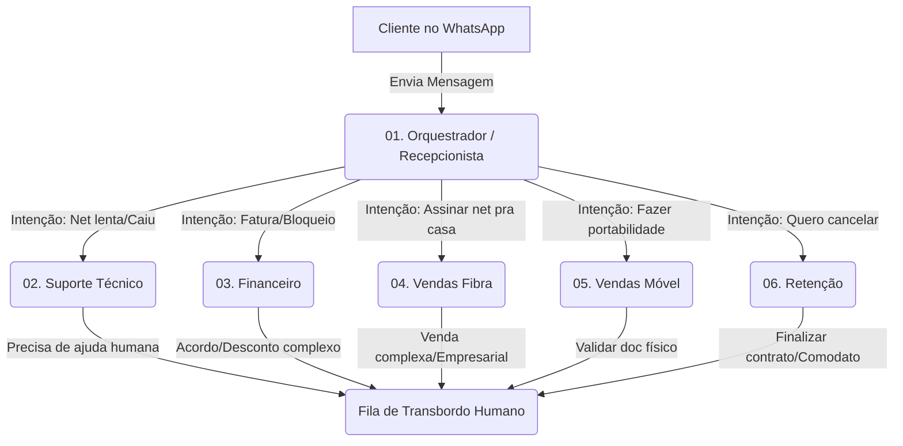

# Tutorial: Como Criar a Árvore de Agentes no Evo CRM

Este guia passo-a-passo ensina como configurar os agentes baseados nos prompts encontrados nesta pasta, criando um sistema de roteamento inteligente (Orquestrador -> Especialistas).

## Regra de Ouro: De Trás para Frente
Para que o Orquestrador possa direcionar o atendimento, **os Sub-agentes Especialistas precisam existir primeiro**. O Evo CRM não permite criar uma regra de transferência para um agente que ainda não foi cadastrado.

Portanto, a ordem de criação na plataforma deve ser:
1. Criar os Sub-agentes (02 a 06).
2. Criar o Orquestrador (01) e conectá-lo aos Sub-agentes.

---

## Passo 1: Criação dos Sub-agentes (Especialistas)

Para cada um dos arquivos numerados de `02` a `06`, repita este processo no painel do Evo CRM:

1. Vá no menu de **Criação de Agentes**.
2. **Tipo de Agente:** Escolha `LLM (Modelo de Linguagem)`. Este é o modelo conversacional que sabe raciocinar e executar funções isoladas.
3. **Nome:** Nomeie conforme o setor (ex: *Suporte Técnico, Vendas Fibra, Financeiro*).
4. **Prompt do Sistema:** Abra o arquivo markdown correspondente (ex: `02-agent-prompt-suporte.md`), copie TODO o conteúdo e cole na caixa de "Contexto/Prompt" do agente.
5. **Ferramentas (Custom Tools):** Para cada ferramenta citada no final do prompt (ex: `get_faturas_pendentes`), adicione a ferramenta/API correspondente conectada ao backend do HubSoft.

*Repita isso para:*
- `02-agent-prompt-suporte.md`
- `03-agent-prompt-financeiro.md`
- `04-agent-prompt-vendas-fibra.md`
- `05-agent-prompt-vendas-movel.md`
- `06-agent-prompt-retencao.md`

---

## Passo 2: Criação do Orquestrador (Recepcionista)

Agora que todos os especialistas estão prontos e salvos no Evo CRM, vamos criar a inteligência que distribui as conversas.

1. Vá no menu de **Criação de Agentes**.
2. **Tipo de Agente:** Aqui você tem duas escolhas boas baseadas no Evo CRM:
   - **Opção A (Mais Comum):** `LLM (Modelo de Linguagem)`. Um agente conversacional normal que tem acesso a "Ferramentas de Transferência" (Function Calling para transferir o chat).
   - **Opção B (Estruturado):** `Tarefa`. Um agente focado unicamente em ler a intenção e orquestrar sub-agentes.
   *(Recomendamos iniciar com **LLM** usando ferramentas de transferência, pois é mais fluído no WhatsApp).*
3. **Nome:** `Recepcionista Virtual` ou `Orquestrador`.
4. **Prompt do Sistema:** Copie o conteúdo do arquivo `01-agent-prompt-orquestrador.md` e cole na configuração.
5. **Configuração de Roteamento (Sub-agentes):**
   - Na seção de Ferramentas/Skills do agente, você deve habilitar a chamada aos sub-agentes criados no Passo 1.
   - O Evo CRM fará com que comandos como `transferir_para_suporte` enviem a transcrição atual do cliente para o agente "Suporte Técnico".

---

## Mapa da Integração (Arquitetura)

## Como a IA toma a decisão?
O Orquestrador analisa apenas a primeira ou segunda frase do cliente. Se o cliente falar "Minha internet não tá funcionando, quero a fatura pra pagar", o Orquestrador usará o raciocínio LLM para definir a prioridade (neste caso, Financeiro para desbloqueio) e acionará a ferramenta `transferir_para_financeiro`. Dali em diante, o agente `03-financeiro` assume e começa a executar os comandos (verificando o HubSoft).
